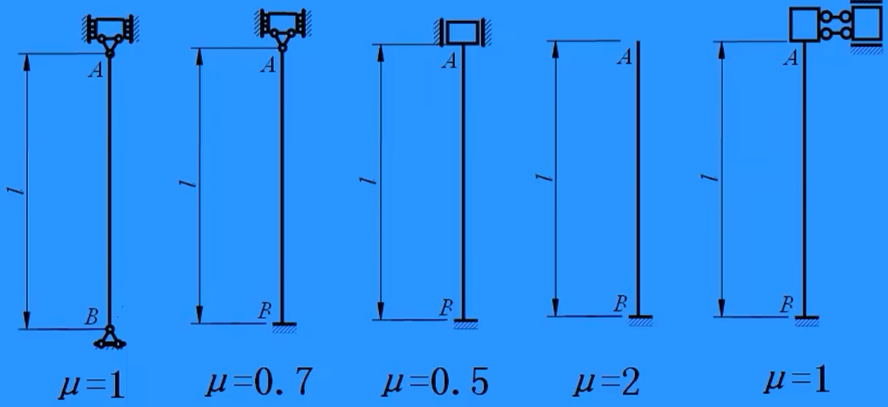

# 压杆稳定

## 压杆稳定性的概念

- **稳定**：理想中心压杆能够保持稳定的（唯一的）直线平衡状态。
- **临界力**：压杆失稳时的轴向压力特殊值（ $F_{\mathrm{cr}}$）。
- **理想中心压杆**：
  1. 压力无偏心。
  2. 直杆（无初曲率）。
  3. 无残余应力。
- **失稳现象**：
  1. 小压力下，保持直线平衡。
  2. 压力达临界值，曲线平衡取代直线平衡。
  3. 压杆失稳时横面将绕弱轴（惯性矩小的形心主轴）转动（此时挠曲平面与弱轴垂直）。

### **分析思路**

- 假设压杆在 $F_{\mathrm{cr}}$ 下处于曲线平衡，求挠曲函数 $w$：
  - 若 $w = 0$：仅直线平衡。
  - 若 $w \neq 0$：存在曲线平衡（失稳）。
- **微分方程**（参考[梁弯曲时的挠曲](梁弯曲时的位移.md#挠曲函数的近似微分方程)）：

$$
EI w^{\prime\prime} = M(x) = -F_{\mathrm{cr}} w
$$

## 欧拉临界力

- **公式**：

$$
F_{\mathrm{cr}} = \frac{\pi^2 E I}{l^2}
$$

或

$$
F_{\mathrm{cr}} = \frac{\pi^2 E I}{(\mu l)^2}
$$

（ $\mu$ 为长度因数，与约束条件相关）

- **影响因素**：
  1. 与材料模量 $E$、惯性矩 $I$、长度 $l$ 有关：  
     $E$ 越大、 $I$ 越大、 $l$ 越短， $F_{\mathrm{cr}}$ 越高。
  2. 反映压杆稳定性承载能力。
  3. 与轴向外力大小无关。
- **约束与 $\mu$**：
  - 约束越强， $\mu$ 越小， $F_{\mathrm{cr}}$ 越高，稳定性越好。
  - 图示：
  - 特殊情况：第五种约束（仅线位移，无转动）。

## 欧拉公式的应用范围

- **柔度**（无量纲）：

$$
\lambda = \frac{\mu l}{i}
$$

- **临界应力**：

$$
\sigma_{\mathrm{cr}} = \frac{\pi^2 E}{\lambda^2}
$$

- **柔度特性**：
  1. 包含压杆除材料外的力学性能信息。
  2. 杆越长、截面越细， $\lambda$ 越大， $\sigma_{\mathrm{cr}}$ 越小，稳定性越差。
- **适用条件**：
  - 线弹性范围： $\sigma_{\mathrm{cr}} \leq \sigma_{\mathrm{p}}$（比例极限）。
  - 柔度要求：

$$
\lambda \geq \lambda_{\mathrm{p}} = \pi \sqrt{\frac{E}{\sigma_{\mathrm{p}}}}
$$

**特别的**：Q235 钢， $\lambda_{\mathrm{p}} = 100$。

- **注意**：
  - XZ 平面失稳， $y$ 轴为中性轴。
  - 圆形铰支座：各方向柔度相同。
  - 矩形截面：优先考虑弱轴或比较临界应力。
  - **考试要求**：需明确说明 $\lambda \geq \lambda_{\mathrm{p}}$ 或杆件为细长杆，否则扣分。

## 设计压杆

- **最优设计**：两平面内稳定性相等，即 $\lambda_x = \lambda_y$。
- **中间添加支座**：
  - 增加 $w = 0$ 约束，等效长度 $l$ 减半。
  - $F_{\mathrm{cr}}$ 增为原 4 倍，稳定性显著提高。
