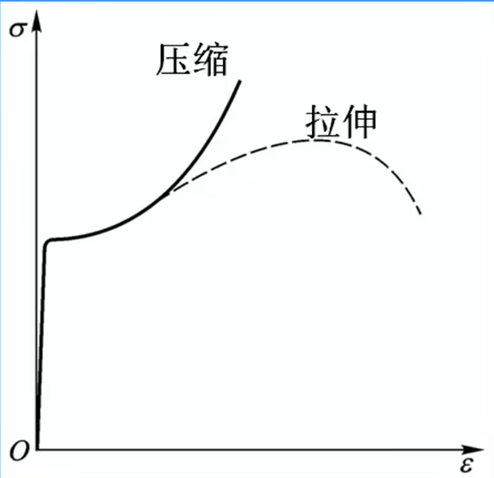

# 材料在拉伸和压缩时的力学性能

## 基本概念

- **名义应力** $\sigma$：由于实验过程中，材料横截面积一直变化，计算应力时，以材料横截的初始面积计算。
- **弹性模量** $E$：材料在弹性变形阶段内应力和应变的比值，用于描述材料抵抗弹性变形的能力，也称为杨氏模量或线应变模量。

*注*：因为名义应力比实际应力小，而在设计时又要求实际荷载小于许可荷载，所以使用名义应力更加安全。

## 低碳钢拉伸的力学性能

### 1. 四个阶段

- **弹性阶段**：应力与应变成正比，卸载后变形完全恢复。
- **屈服阶段**：应力增长缓慢，但变形急剧增加，应力基本保持不变。主要为塑性变形。
- **强化阶段**：应力再次随应变增加，材料强度提高。卸载过程为直线。
- **破坏阶段**：应力达到强度极限后，应力减少，材料出现「颈缩现象」，最终断裂，形成杯状断口。

### 2. 三个强度指标

- **比例极限** $\sigma_p$：弹性阶段内应力与应变保持正比的最大应力。
- **屈服极限** $\sigma_s$：材料在受力过程中，从弹性变形过渡到塑性变形的临界应力值，即材料能够承受的最大应力而不会发生永久变形（即塑性变形）。
- **强度极限** $\sigma_b$：材料在受力过程中所能承受的最大应力。

### 3. 两个塑性指标

- **伸长率** $\delta$：$\delta = \frac{l_1 - l}{l} \times 100\%$，其中 $l$ 为试件的原始长度，$l_1$ 为断裂后的长度。
- **断面收缩率** $\psi$：$\psi = \frac{A - A_1}{A} \times 100\%$，其中 $A$ 为试件的原始横截面积，$A_1$ 为断裂处的横截面积。

### 4. 其他特性

- **冷作硬化**：将材料拉伸到强化阶段再卸载到 0，会产生大量残余形变，再加载会使材料塑性降低。
- **冷作时效**：将材料拉伸到强化阶段再卸载到 0，将材料放置一段时间后再加载，使材料进入强化阶段所需的应力变大。材料的比例极限和强度极限提高，但塑性降低。

## 名义屈服极限

- **名义屈服极限** $\sigma_{\mathfrak{p}0.2}$：当材料没有明显的屈服阶段时，定义为残余应变等于 0.2% 对应的卸载点应力。

## 低碳钢与铸铁的拉伸与压缩比较

### 低碳钢

- **拉伸**：
  - 有线弹性阶段。
  - 抗拉强度高。
  - 伸长率高。
  - 有颈缩现象，断口呈杯状。
- **压缩**：
  - 有线弹性阶段。
  - 抗压强度高。
  - 压缩成鼓状。

低碳钢应力曲线：

### 铸铁

- **拉伸**：
  - 无明显的线弹性阶段。
  - 没有直线段。
  - 抗拉强度低。
  - 伸长率低。
  - 无颈缩现象，断口齐整。
- **压缩**：
  - 无明显的线弹性阶段。
  - 几乎没有直线段。
  - 抗压强度高。
  - 伸长率比拉伸时大。
  - 压断时，破坏面法线与轴线呈 50° 至 55° 夹角。

铸铁应力曲线近似为 $log$ 函数图像，但拉伸时没有直线段。

## 许用应力

- **许用应力** $\left [ \sigma \right ]$：$\left [ \sigma \right ] = \frac{\sigma_u}{n}$，其中 $\sigma_u$ 为材料的强度极限，$n > 1$ 称为安全因素。
- **安全因素** $n$：
  - **脆性材料**：$n$ 一般取 2.5 ~ 3.0，甚至 4 ~ 14。
  - **塑性材料**：$n$ 一般取 1.25 ~ 2.5。
