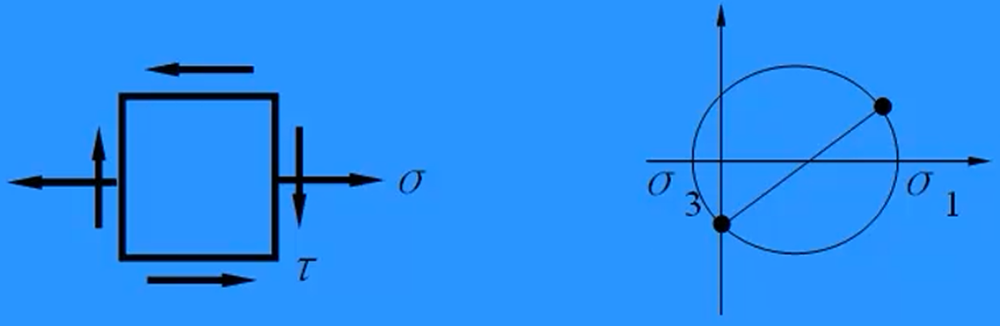

# 应力状态

取单元体进行受力分析：

1. 正应力以拉为正，压为负；
2. 切应力以使单元体产生顺时针旋转趋势为正，反之为负；
3. $\tau _x$ 和 $\tau _y$,一正一负;
4. 以铅锤线为起始位置，$α$ 以逆时针为正，顺时针为负；

要计算斜截面上的力，取分离体进行受力分析。

注：只能对**力**列平衡方程，而不能直接对**应力**列平衡方程。

斜截面上的应力公式（使用条件：单元体）：

$$\begin{aligned}
 & \sigma_{\alpha}=\frac{\sigma_{x}+\sigma_{y}}{2}+\frac{\sigma_{x}-\sigma_{y}}{2}\mathrm{cos}2\alpha-\tau_{x}\mathrm{sin}2\alpha \\
 & \tau_{\alpha}=\frac{\sigma_{x}-\sigma_{y}}{2}\mathrm{sin}2\alpha+\tau_{x}\mathrm{cos}2\alpha
\end{aligned}$$

不同斜截面上的应力仅与斜截面的倾角$\alpha$有关。而与截面的大小和位置无关

倾角范围：0°~180°，$\alpha$ 的有效范围：-90°~90°

单元体左右两侧截面 $\alpha=0°$，上下两侧截面 $\alpha=90°$

## 应力圆（圆上的点以 $D$ 表示）

公式：

$$
(\sigma_\alpha-\frac{\sigma_x+\sigma_y}{2})^2+\tau_\alpha^2=(\frac{\sigma_x-\sigma_y}{2})^2+\tau_x^2
$$

作图法：

1. 作出 $D_x(\sigma _x, \tau _x)$  和 $D_y(\sigma _y, \tau _y)$ 两个点，连接 $D_x$ 和 $D_y$，则 $D_x D_y$ 为应力圆直径，与 $\sigma$ 交线为圆心。
2. 若采用的两点 $D_A$ 和 $D_B$ 来自任意受力体，则 $D_A D_B$ 的中垂线与 $\sigma$ 轴的交点为圆心。
3. 确定应力圆上斜截面的位置。
4. 确定斜截面上的应力。

利用应力圆求斜截面上的应力时应注意：
1. 应力圆的旋转起始线是 $CD_x$ 线，而非$\sigma$轴。
2. 应力圆上的旋转方向须与单元体上斜截面的旋转方向一致。
3. 应力圆上旋转的角度是 $2a$。

$\sigma_\alpha+\sigma_{90^\circ+\alpha}=\sigma_\beta+\sigma_{90^\circ+\beta}$

任意两组***互相垂直的斜截面**上的正应力之和* 相等，和为**应力圆的圆心**的横坐标。知三求一。

## 主平面和主应力

主平面：单元体上切应力为零的斜截面
主应力：作用在主平面上的正应力

1. 主平面是应力圆与 $\sigma$ 轴的交线
2. 主应力是一个点各个方向上最大的正应力。
3. 应力圆上的两个主应力：一个极大值，一个极小值。

主应力计算公式（使用条件：单元体）：

$$
\sigma_{1}=\frac{\sigma_x+\sigma_y}{2}+\sqrt{(\frac{\sigma_x-\sigma_y}{2})^2+\tau_x^2} \\
\sigma_{3}=\frac{\sigma_x+\sigma_y}{2}-\sqrt{(\frac{\sigma_x-\sigma_y}{2})^2+\tau_x^2}
$$

主平面倾角 $\alpha_0$ 是单元体的倾斜角度。

$\alpha_0$ 的计算公式（使用条件：单元体）：

$$
2\alpha_0=\arctan\frac{-2\tau_x}{\sigma_x-\sigma_y}
$$

根据 $\frac{-2\tau_x}{\sigma_x-\sigma_y}$ 来判断 $2\alpha _0$ 可能的象限，再根据分子分母是否同号来确定位于第几象限。

## 空间应力状态

主单元体：由三组主平面组成的单元体，有三个主应力，且$\sigma_1 \ge \sigma_2 \ge \sigma_3$

三种应力状态：
- 三向应力状态：三个主应力均不为 0
- 平面应力状态：三个主应力有两个不为 0
- 单向应力状态：三个主应力中只有一个不为 0

### 常见的平面应力状态

#### 单向应力状态

轴向拉压、梁的上下表面

#### 平面应力状态

##### 纯剪应力状态

纯剪应力状态：$\sigma_1=\tau \ge \sigma_2=0 \ge \sigma_3=-\tau$

受扭的轴、梁的中性轴上

##### 单轴应力状态

梁除上下表面和中性轴之外的部位：$\sigma_1 \ge \sigma_2=0 \ge \sigma_3$

### 三向应力圆

画应力圆的时候没有用到哪个主应力，对应的斜截面就平行于这个应力。

### 最大切应力面

1. 平行于 $\sigma_2$。
2. 与 $\sigma_1$ 和 $\sigma_3$ 的 *作用面* 夹角均为 45°。
3. 最大切应力作用面上正应力不一定等于零。
4. 应力圆心横坐标：$\frac{\sigma_1+\sigma_3}{2}$
5. 最大切应力：$\frac{\sigma_1-\sigma_3}{2}$
