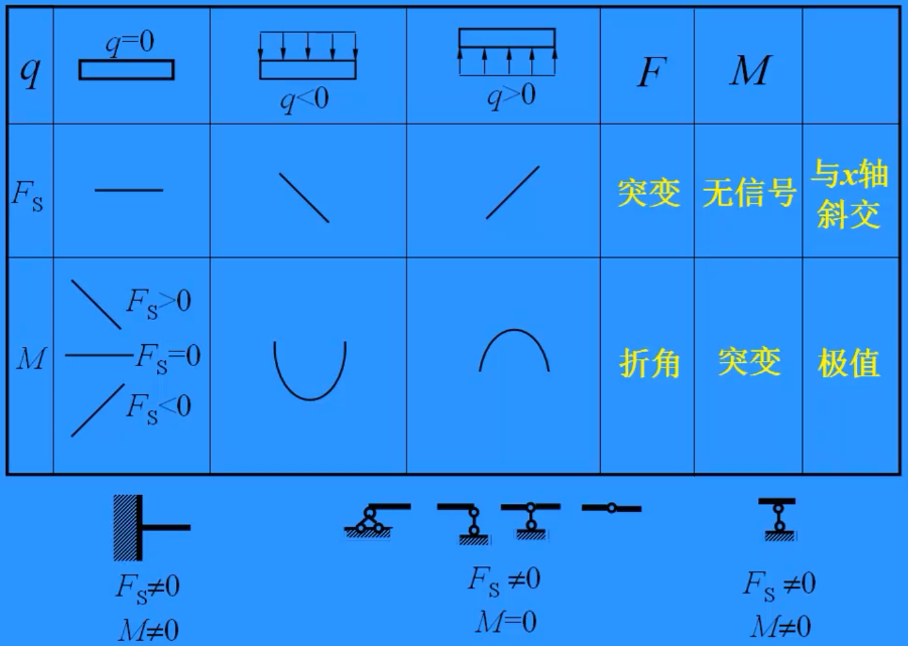
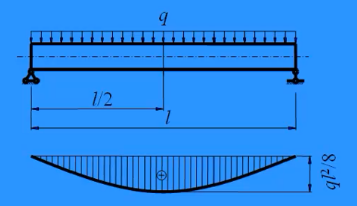
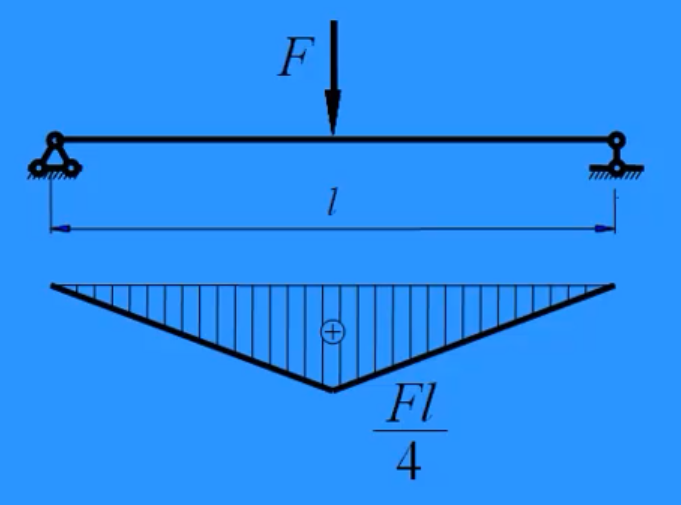

# 弯曲内力

## 基本特征

- **几何特点**：等直杆。
- **受力特点**：受垂直于杆轴的横向力或外力偶（矢量垂直于杆轴）。
- **变形特点**：
  1. 直杆轴线变形后变为曲线。
  2. 任意两横截面绕垂直于杆轴的轴相对转动。

## 剪力与弯矩的符号规则

- **剪力**：
  - 正：使分离体顺时针旋转。
  - 负：使分离体逆时针旋转。
- **弯矩**：
  - 正：下表面受拉，上表面受压。
  - 负：下表面受压，上表面受拉。

## 弯矩图绘制要点

- **三要素**：端点值、凹凸方向、极值点。
- **约定**：
  - $y$ 轴向下。
  - 正弯矩：图形向下（下表面受拉）。
  - 负弯矩：图形向上（上表面受拉）。
- **突变**：
  - 集中弯矩逆时针：向上突变（减小）。
  - 集中弯矩顺时针：向下突变（增大）。
- **均布荷载**：
  - 弯矩图为抛物线。
  - 荷载向下：抛物线图形向下。
  - 荷载向上：抛物线图形向上。
- **绘图规则**：画在杆件受拉侧，不区分正负。

## 弯曲内力的微分关系

- **公式**：
  1. $\frac{\mathrm{d}M(x)}{\mathrm{d}x} = F_\mathrm{s}(x)$  
     （弯矩对 $x$ 的导数为剪力）
  2. $\frac{\mathrm{d}F_\mathrm{s}(x)}{\mathrm{d}x} = q(x)$  
     （剪力对 $x$ 的导数为荷载强度）
- **面积法**：
  - 剪力：$F_{\mathrm{Sx}_2} = F_{\mathrm{Sx}_1} + S_q$  
    （$S_q$ 为荷载图围成面积）
  - 弯矩：$M_{x_2} = M_{x_1} + S_{F_\mathrm{S}}$  
    （$S_{F_\mathrm{S}}$ 为剪力图围成面积）
- **荷载符号**：向上为正，向下为负。
- **注意**：面积法计算时，避免跨过集中力或集中力偶。

## 图示参考

