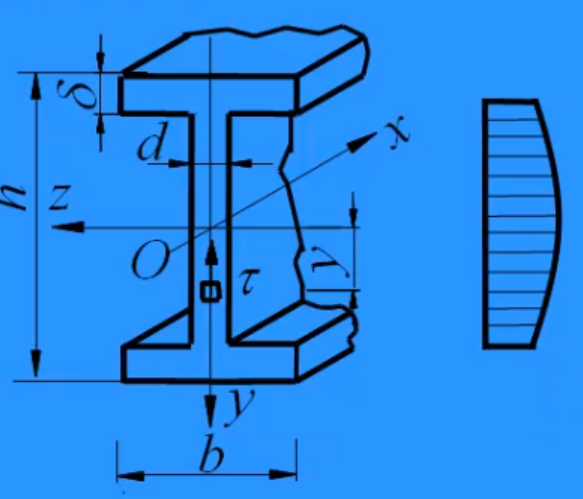

# 弯曲应力

## 定义

- **纯弯曲**： $F_s = 0$， $M = \text{常量}$。
- **横力弯曲**： $F_s \neq 0$， $M = M(x)$。

## 纯弯曲

### **基本假设**

- **平面假设**：
  - 横截面变形后仍为平面，与变形轴线正交。
  - 绕垂直于纵对称平面的轴转动。
  - 纵横线垂直，无剪应变（ $\tau = 0$）。
  - 正应力沿宽度均匀分布。

### **中性层与中性轴**

- **中性层**：不受拉压的过渡层。
- **中性轴**：中性层与横截面的交线，通常为形心轴 $z$。

### **正应力**

- **应变**： $\varepsilon = \frac{a}{\rho}$  
  （ $a$ 为截面到中性层的距离， $\rho$ 为中性层曲率半径）
- **正应力公式**： $\sigma = E \varepsilon = E \frac{a}{\rho}$
- **弯曲刚度**： $\frac{1}{\rho} = \frac{M_z}{EI_z}$  
  （变形轴线为圆曲线）
- **综合公式**：

$$
\sigma = \frac{M_z y}{I_z}
$$

$$
\sigma = \frac{M}{W_z}
$$

$W_z = \frac{I_z}{y_{\max}}$ 为弯曲截面系数

#### **弯曲正应力的合力**

即求对应区域，弯曲正应力形成的体积。

### **截面系数 $W_z$**（单位： $\mathrm{mm^3}$）

- **中性轴 $z$ 为对称轴**：
  - 矩形： $W_z = \frac{b h^2}{6}$
  - 圆形： $W_z = \frac{\pi d^3}{32}$
  - 空心圆： $W_z = \frac{\pi D^3}{32} (1 - \alpha^4)$
- **中性轴 $z$ 非对称轴**：
  - 最大拉应力： $\sigma_{t,\max} = \frac{M y_{t,\max}}{I_z}$
  - 最大压应力： $\sigma_{c,\max} = \frac{M y_{c,\max}}{I_z}$

### **图示**

- 

## 横力弯曲

- **特点**：平面假设不成立，但梁高较小时，可近似按纯弯曲计算正应力。

## 计算示例

- **简支梁跨中集中力**： $M_{\max} = \frac{F L}{4}$
- **应力符号**：带入坐标正负， $\sigma > 0$ 为拉应力， $\sigma < 0$ 为压应力。
- **比例计算**：已知最大应力，按距离比例求其他截面应力。

## 强度条件

- **要求**：
  - $\sigma_{t,\max} \leq [\sigma_t]$ （拉应力）
  - $\sigma_{c,\max} \leq [\sigma_c]$ （压应力）
- **注意情况**：
  1. 材料为铸铁。
  2. 截面上下不对称。
  3. 正负弯矩大小相当。
  4. 上下截面弹性模量不同（中性轴偏离几何中点）。
- **比例关系**：  
  $\frac{\sigma_{t,\max}}{\sigma_{c,\max}} = \frac{y_t}{y_c} = \frac{[\sigma_t]}{[\sigma_c]}$

## 伸长量

- **公式**： $\Delta L = \frac{2}{E W} \int_0^{L/2} M(x) \, \mathrm{d}x$

## 弯曲切应力

- **定义**：由剪力 $F_s$ 引起的切应力，沿宽度均匀分布，与剪力方向一致。
- **公式**：

$$
\tau = \frac{F_s S_z}{b I_z}
$$

其中， $F_s$：剪力；$S_z$：计算点一侧对 $z$ 轴的静矩；$b$：计算点处宽度；$I_z$：惯性矩

### **典型截面切应力**

1. **矩形截面**：
   - 公式： $\tau = \frac{F_s}{2 I_z} \left( \frac{h^2}{4} - y^2 \right)$
   - 最大切应力（中性轴处）：

$$
\tau_{\max} = \frac{3 F_s}{2 A}
$$

- 

2. **工字形截面**：
   - 腹板：切应力呈二次抛物线分布。
   - 顶板：切应力线性分布。
   - 计算：腹板切应力只需考虑交界处截面。
   - 

3. **槽型截面**：
   - 

4. **薄壁圆环**：
   - 最大切应力：

$$
\tau_{\max} = \frac{2 F_s}{A}
$$

- 

5. **圆形截面**：
   - 最大切应力：

$$
\tau_{\max} = \frac{4 F_s}{3 A}
$$

- 

### **工字钢切应力流**

- 
