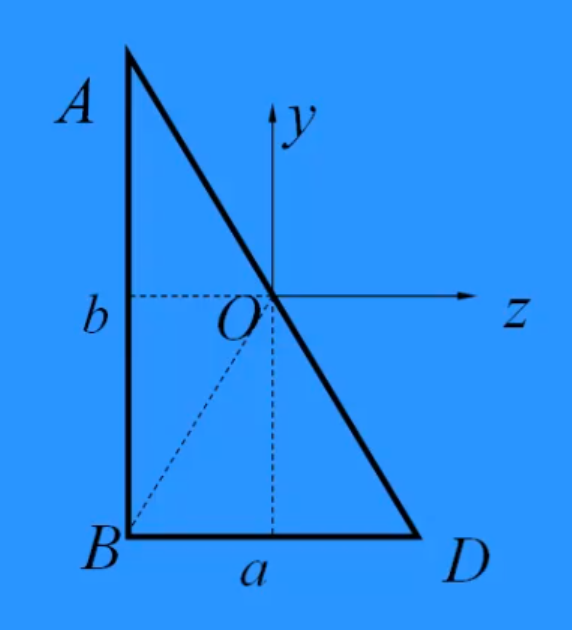
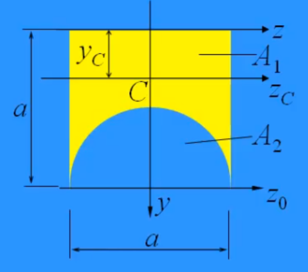

# 截面的几何性质

## 静矩与形心

### **静矩**

- **定义**：截面各微面积与其到某轴距离乘积的总和。
- **关键性质**：
  1. 与轴位置相关，需指明参考轴。例如，对 $y$ 轴的静矩：  
     $S_y = \int_A z \, \mathrm{d}A$
  2. 有方向，正负取决于图形与轴的位置。
  3. 对形心轴的静矩为零，形心轴即静矩为零的轴。
- **单位**：$\mathrm{m^3}$ 或 $\mathrm{mm^3}$
- **计算公式**（$c$ 为形心）：  
  $S_y = A z_c$  
  $S_z = A y_c$

### **形心**

- **坐标公式**：  
  $z_c = \frac{\int_A z \, \mathrm{d}A}{A} = \frac{S_y}{A}$  
  $y_c = \frac{\int_A y \, \mathrm{d}A}{A} = \frac{S_z}{A}$
- **示例**：半圆形心坐标（直径沿 $z$ 轴）：$y_c = \frac{2d}{3\pi}$
- **性质**：形心轴将图形分为两部分，对形心轴的静矩大小相等、符号相反。
- **补充**：不规则形心计算可参考《理论力学》的直接法和补全法。

#### 特殊图形的形心

- **三角形**：  
  $x_c=\frac{\sum_{i=1}^3x_i}{3},y_c=\frac{\sum_{i=1}^3y_i}{3}$
- **半圆**：  
  $x_c=\frac{2d}{3\pi},y_c=\frac{2d}{3\pi}$

## 惯性矩与相关参数

### **极惯性矩**

- **定义**：$I_p = \int_A \rho^2 \, \mathrm{d}A$
- **关系**：$I_p = I_y + I_z$

### **惯性矩**（面积惯性矩或面积二阶矩）

- **定义**：反映截面面积关于轴的分布，也称面积二阶矩。  
  $I_y = \int_A z^2 \, \mathrm{d}A$  
  $I_z = \int_A y^2 \, \mathrm{d}A$
- **性质**：
  1. 恒为正（平方项）。
  2. 值越大，面积离轴越远。
- **单位**：$\mathrm{m^4}$ 或 $\mathrm{mm^4}$

### **惯性积**

- **定义**：$I_{yz} = \int_A yz \, \mathrm{d}A$
- **性质**：
  1. 可正可负。
  2. 若 $y$ 或 $z$ 轴为对称轴，则 $I_{yz} = 0$.
- **单位**：$\mathrm{m^4}$ 或 $\mathrm{mm^4}$

### **惯性半径**

- **定义**：惯性矩除以面积的开方

  $i_y = \sqrt{\frac{I_y}{A}}$  
  $i_z = \sqrt{\frac{I_z}{A}}$

- **单位**：$\mathrm{m}$ 或 $\mathrm{mm}$

#### 常见图形的惯性半径

- **矩形**：

   $i_y = \frac{\text{与 y 轴垂直的边长}}{\sqrt{12}}$

- **圆形**：

   $i_y = i_z = \frac{d}{4}$

## 典型图形的惯性矩

- **矩形**（形心在原点，$b$ 沿 $z$ 轴，$h$ 沿 $y$ 轴）：

   $I_z = \frac{b h^3}{12}$  
   $I_y = \frac{h b^3}{12}$

- **三角形**（形心轴平行底边，底 $b$，高 $h$）：

   $I_z = \frac{b h^3}{36}$

- **三角形**（关于底边，底 $b$，高 $h$）：

   $I_z = \frac{b h^3}{12}$

- **圆**（形心在圆心）：

   $I_y = I_z = \frac{I_p}{2}= \frac{\pi d^4}{64}$

- **空心圆**（外径 $D$，内径 $d$）：

   $I_z = I_p = \frac{\pi D^4}{64} (1 - \alpha^4)$

- **半圆**（关于直径轴）：

  $I_z = \frac{\pi D^4}{128}$

## 平行移轴公式

- **公式**：  
  $I_z = I_{z_c} + a^2 A$  
  $I_y = I_{y_c} + b^2 A$  
  $I_{yz} = I_{y_c z_c} + ab A$
- **条件**：
  1. 平移前后两轴中，至少一轴为形心轴。
  2. $a$、$b$ 为形心在 $yoz$ 坐标系中的坐标，可正可负。
- **性质**：对形心轴的惯性矩最小。

## 计算示例

1. **延长坐标轴**  
   - 分解：反向延长 $y$、$z$ 轴，将三角形分为对称子图形 $\triangle AOB$ 和 $\triangle BOD$。  
   - 图示：

      

1. **补全法**  
   - 问题：求图形对 $z_c$ 轴的惯性矩。  
   - 方法：假想在 $z_0$ 下方补一正方形（边长 $a$），与上方组成对称长方形。  
   - 计算：  
     $I_{z_0} = I_{z_{01}} - I_{z_{02}} = \frac{1}{2}(\frac{a(2a)^3}{12}-\frac{\pi a^4}{64}) = \frac{a^4}{3} - \frac{\pi a^4}{128}$  
   - 图示：

      

## 复杂图形划分原则

- **要求**：
  1. 各子图形的形心已知。
  2. 各子图形对自身形心轴的惯性矩已知。
- **适用图形**：矩形、圆、半圆、三角形。

## 补充说明

[扭转中的 $I_p$ 见此。](扭转.md#截面几何参数)

## 惯性矩与惯性积的转轴公式

- **公式**：  
  $I_{z1} = \frac{I_z + I_y}{2} + \frac{I_z - I_y}{2} \cos 2\alpha - I_{yz} \sin 2\alpha$  
  $I_{y1 z1} = \frac{I_z - I_y}{2} \sin 2\alpha + I_{yz} \cos 2\alpha$
- **条件**：
  1. 原点必须重合。
  2. 两轴惯性矩之和恒定。
  3. 坐标轴两两垂直。
- **四矩式**：  
  $I_{y1} + I_{z1} = I_{y2} + I_{z2} = I_p$（极惯性矩）

## 截面的主惯性轴与主惯性矩

### **主惯性轴**

- **定义**：惯性积 $I_{yz} = 0$ 的一对坐标轴。
- **确定公式**：  
  $\tan 2\alpha_0 = \frac{-2 I_{yz}}{I_z - I_y}$  
  （$\alpha_0$ 为转轴角度）

### **主惯性矩**

- **定义**：截面关于主惯性轴的惯性矩。
- **计算公式**：  
  $I_{z_0} = \frac{I_z + I_y}{2} + \frac{1}{2} \sqrt{(I_z - I_y)^2 + 4 I_{yz}^2}$  
  $I_{y_0} = \frac{I_z + I_y}{2} - \frac{1}{2} \sqrt{(I_z - I_y)^2 + 4 I_{yz}^2}$  
- **特点**：  
  - $I_{z_0}$ 和 $I_{y_0}$ 区别仅在于正负号。
  - 过同一点的轴系中，主轴可能不唯一，但主惯性矩唯一。

### **形心主轴与形心主矩**

- **定义**：
  - **形心主轴**：原点与形心重合的主惯性轴。
  - **形心主矩**：截面关于形心主轴的惯性矩。
- **性质**：
  - 较小的形心主矩（如 $I_{y_0}$）是惯性矩的最小值。
  - 较大的形心主矩（如 $I_{z_0}$）不是最大值。

### **形心主轴与形心主矩的确定**

1. **多对称轴**（≥3 根，如正多边形、圆、三角形）：  
   - 过形心的任意轴均为形心主轴，惯性矩相等。
2. **两垂直对称轴**（如矩形、工形）：  
   - 这两轴即为形心主轴。
3. **单对称轴**（如 T 形、C 形）：  
   - 对称轴为形心主轴，另一主轴与其垂直。
4. **无对称轴**：  
   - 需通过转轴公式计算一般情况下的主轴与主矩。
