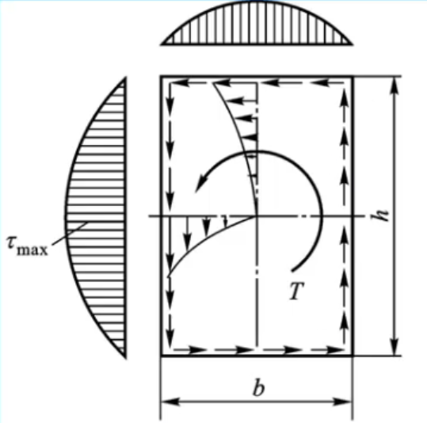

# 扭转

## 扭转的基本特性

1. **几何形状**：等直圆杆。
2. **受力特点**：大小相等、方向相反、作用面垂直于杆轴线的力偶。
3. **变形特点**：横截面绕轴心转动。

## 扭矩与功率的关系

- **转速** $n$ ($\mathrm{r/min}$)、**功率** $P$ ($\mathrm{kW}$) 与**外力偶矩** $M$ ($\mathrm{kN}\cdot\mathrm{m}$) 之间的关系：
  $$
  M = 9.55 \frac{P}{n}
  $$
- **功率守恒**：对于多轮传动系统，任意一轮的功率等于其他所有轮功率之和，即：
  $$
  P_1 = P_2 + P_3
  $$

### 力偶与转向的关系

- **主动轮**：外力偶的转向与传动轴的转向相同。
- **从动轮**：外力偶的转向与传动轴的转向相反。
- **符号约定**：
  - 力偶矢量离开截面为正。
  - 力偶矢量指向截面为负。

## 切应力

- **定义**：切应力 $\tau$ 是作用在一个面内的应力。
- **特点**：等直圆杆受扭转时，横截面上仅存在作用在横截面内的切应力。

### 切应力计算

- **切应力公式**：
  $$
  \tau_\rho = \frac{T \cdot \rho}{I_p}
  $$
  其中：
  - $\tau_\rho$：距轴心半径为 $\rho$ 处的切应力。
  - $T$：扭矩。
  - $\rho$：距圆心的径向距离（半径）。
  - $I_p$：横截面的极惯性矩。

- **最大切应力**：
  $$
  \tau_{\max} = \frac{T}{W_p}
  $$
  其中：
  - $T$：扭矩。
  - $W_p$：扭转截面系数。

### 切应力分布特点

1. 切应力的旋向与所在点的半径垂直，且与本截面的扭矩方向一致。
2. 沿半径方向呈三角形规律分布，即线性分布。
3. 圆心处（$\rho = 0$）切应力为零。
4. 外圆周处（$\rho$ 最大）切应力达到最大。
5. 由 3、4 得，空心圆截面上最大切应力与最小切应力有如下关系：

$$
\frac{\tau_{\max}}{\tau_{min}}=\frac{D}{d}
$$

## 截面几何参数

### 1. 实心圆截面

- $d$：直径。
- **极惯性矩** $I_p$：
  $$
  I_p = \frac{\pi d^4}{32}
  $$
- **扭转截面系数** $W_p$：
  $$
  W_p = \frac{\pi d^3}{16}
  $$

### 2. 空心圆截面

- $D$：外圆直径。
- $d$：内圆直径。
- $\alpha = \frac{d}{D}$：内外径比。
- **极惯性矩** $I_p$：
  $$
  I_p = \frac{\pi D^4}{32} (1 - \alpha^4)
  $$
- **扭转截面系数** $W_p$（$\alpha$为依旧为 4 次方）：
  $$
  W_p = \frac{\pi D^3}{16} (1 - \alpha^4)
  $$

## 材料扭转时的力学性能

### 低碳钢

断口平整，是因为低碳钢轴受扭的破坏是横截面上的切应力所导致

### 铸铁

断口为与轴线呈 45° 的斜截面，是因为受扭的破坏是 45° 斜截面上的拉应力所导致。

## 扭转胡克定律

$\varphi=\frac{Tl}{GI_p}=\frac{M_el}{GI_p} (\mathrm{rad})$

- $T$：扭矩。
- $l$：长度。
- $G$：切变模量。
- $I_p$：极惯性矩。

与[拉压胡克定律](./形变.md#形变计算)类似，$Tl$ 是扭矩图的面积。

$GI_p$：扭转刚度，反映轴抵抗扭转变形的能力。在其他条件相同的情况下，扭转刚度越大，变形就越小。扭转刚度越小，变形就越大。

1. 适用于线弹性阶段。
2. 计算长度范围内其它三个量为常量。
3. 扭转角为标量，方向与杆内扭矩相同。

### 单位扭转角

$\varphi_{\max}=\frac{\varphi_{\max}}{l}=\frac{T_{\max}}{GI_{p}}$

### 许可单位长度扭转角

$\varphi_{\max}^{\prime}=\varphi_{\max}\times\frac{180}{\pi} (\mathrm{°/m})$

要求：$\varphi_{\max}^{\prime} < \left [ \varphi \right ]$

注：$\varphi_{\max}^{\prime}$带入计算时，单位中的 $\mathrm{m}$ 化为 $\mathrm{mm}$ 时，为 $10^{-3}$。

## 剪切胡克定律

$\tau=G\gamma$

其中，$\gamma$ 称为切应变，是因错动而倾斜的角度，也就是单元体直角的该变量，单位 $\mathrm{rad}$。

## 等直非圆杆自由扭转时的应力和变形

### 变形特点

- 自由扭转（纯扭转）：等直杆两端受外力偶作用，可自由翘曲时；此时相邻两横截面的翘曲程度完全相同，无附加正应力产生。
- 约束扭转（翘曲受到约束）：不能自由翘曲；此时相邻两横截面的翘曲程度不同，横截面上有附加正应力产生。

### 应力分布

1. $\tau \le \tau_p$：
   1. 在周边长边的中点处 $\tau_{\max}$
   2. 中心和四个角点处 $\tau=0$。
   3. 周边各点的切应力与周边相切。
   4. 沿周边上的一点与中心的连线，切应力呈曲线分布
