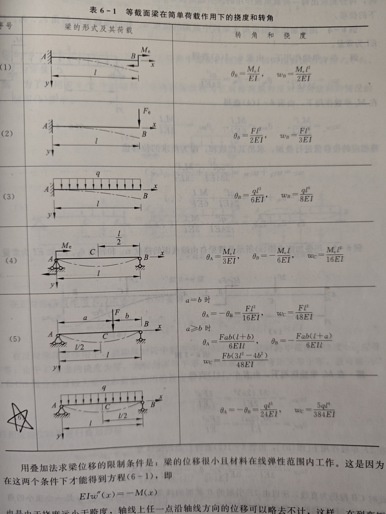

# 梁弯曲时的位移

## 基本概念

- **挠度**：梁弯曲后，横截面相对于原位置的垂直位移，向下为正。
  - **挠曲函数**： $w = f(x)$
- **转角**：梁上一点法线与 $y$ 轴的夹角（顺时针为正）；或切线与 $x$ 轴的夹角（从 $x$ 轴顺时针旋转为正）。
  - **转角函数**： $\theta \approx \tan \theta = w^{\prime}$
  - 转角很小时， $w = \theta l$

## 积分法

### **挠曲函数的近似微分方程**

$$
EI w^{\prime\prime} = -M(x)
$$

- 由纯弯曲公式 $\frac{1}{\rho} = \frac{M}{EI}$ 推广至横力弯曲。
- **求解**：通过两次不定积分，利用位移条件确定积分常数。

### **位移条件**

1. 支座处： $w = 0$
2. 转角为零处： $w^{\prime} = 0$
3. 连续处： $w_1 = w_2$ 或 $w_1^{\prime} = w_2^{\prime}$

### **计算步骤**

1. 建立弯矩函数 $M(x)$，反映挠曲线位置。
2. 两次积分求挠曲函数 $w(x)$。
3. 根据挠曲线的线性得到位移条件，确定积分常数。

## 分段积分

- **原则**：挠曲微分方程变化处需分段，如：
  - 支座、集中力、外力偶、均布荷载边界。
- **位移条件数量**：等于积分常数个数。
- **边界条件**：
  1. 固定端： $w = 0$， $w^{\prime} = 0$
  2. 铰支座： $w = 0$
  3. 弹簧支座：支座反力和变形量可求。
- **连续条件**（分界点）：
  - $w_1 = w_2$（通常为 0）
  - $w_1^{\prime} = w_2^{\prime}$

### **挠曲线特性**

- $M(x) = 0$：挠曲线为斜直线。
- $M(x) \neq 0$：挠曲线为曲线。
- $M(x) > 0$：挠曲线向下凸。
- $M(x) < 0$：挠曲线向上凸。
- $M(x) = 0$ 的截面：出现反弯点。

## 叠加法

- **适用条件**：
  1. 线弹性范围。
  2. 小变形。
- **原理**：位移为各外力引起位移的代数和。
- **简化方法**：
  1. **切断简化法**：平移力，平衡力偶和弯矩到截面。
  2. **对称问题**：简支梁且荷载对称时，可切开一半：
     - **对称问题**：取切口为固定支座，将一简支端改为自由端；保留半跨上的载荷和简支端的反力。
     - **反对称问题**：将简支梁从跨中切断，改为半跨的简支梁；保留半跨上的载荷。

- **公式**：
