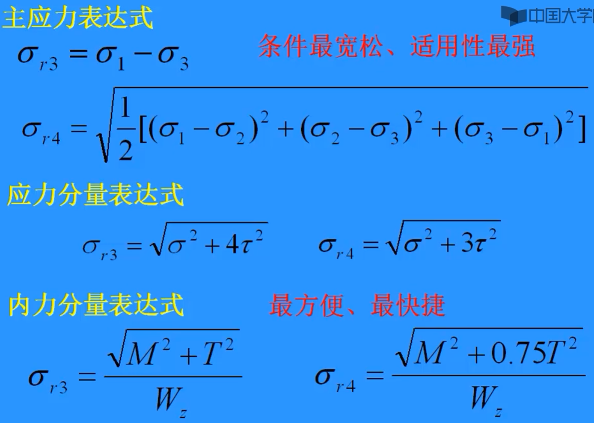

# 组合变形

（斜弯曲部分我没记。）

## 弯扭组合

- **定义**：构件同时受弯矩 $M$ 和扭矩 $T$ 作用。
- **相当弯矩**（根据第三、第四强度理论）：

$$
M_{r3} = \sqrt{M^2 + T^2}
$$

$$
M_{r4} = \sqrt{M^2 + 0.75 T^2}
$$

- **相当应力**：

$$
\sigma_{r3} = \frac{M_{r3}}{W_z} = \frac{\sqrt{M^2 + T^2}}{W_z}
$$

$$
\sigma_{r4} = \frac{M_{r4}}{W_z} = \frac{\sqrt{M^2 + 0.75 T^2}}{W_z}
$$

（$W_z$ 是 [弯曲截面系数](弯曲应力-正、切应力.md#弯曲截面系数)）

### **计算步骤**

1. **分解内力**：
   - 按力方向分组：求 $M_y$（垂直于 $y$ 轴的力产生的弯矩）和 $M_z$（垂直于 $z$ 轴的力产生的弯矩）。
2. **合成总弯矩**：
   - 用 L2 范数计算总弯矩： $M = \sqrt{M_y^2 + M_z^2}$。
3. **计算相当应力**：
   - 代入第三或第四强度理论公式，求 $\sigma_{r3}$ 或 $\sigma_{r4}$。

### **使用条件**

1. 符合强度理论的应力分量表达条件。
2. 适用于圆截面杆。
3. 切应力主要由扭矩 $T$ 产生
   - 切应力还可以由[弯曲剪力](弯曲内力-剪力与弯矩.md)产生。
4. 正应力主要由弯矩 $M$ 产生。
   - 正应力还可以由轴力产生，若存在轴力 $F_N$，正应力为：

$$
\sigma = \frac{F_N}{A} + \frac{M}{W_z}
$$

### **主应力与内力表达式**

计算参数从上到下，越来越容易得到，所以内力分量表达式最方便。但适用范围越来越小。

- **图示**：
